:::::::::::::::::::::::::::::::::::::: questions 

- How do we create graphs using R?

::::::::::::::::::::::::::::::::::::::::::::::::

::::::::::::::::::::::::::::::::::::: objectives

- Learn how to create bar and line charts using ggplot2
- Learn how to customize the appearance of the charts

::::::::::::::::::::::::::::::::::::::::::::::::


```r
library(ggplot2)
library(readr)
library(dplyr)
library(lubridate)
```

## Creating graphs

We are going to be using functions from the **`ggplot2`** package to create visualizations.  **`ggplot`** plots are built step by step by adding new layers, which allows for extensive customization of plots.


We call `ggplot()` function, and pass in data and mappings. Then we call a `geom_` function to create the plot. 

` ggplot(data = <DATA>, mapping = aes(<MAPPINGS>)) + <GEOM_FUNCTION>()`


## Setup

First, read data from the cleaned iNaturalist observation file.


```r
inat <- read_csv('data/cleaned/observations.csv')
```

```output
Rows: 93950 Columns: 39
── Column specification ────────────────────────────────────────────────────────
Delimiter: ","
chr  (23): observed_on_string, time_observed_at, time_zone, user_login, user...
dbl  (10): id, user_id, num_identification_agreements, num_identification_di...
lgl   (5): captive_cultivated, private_place_guess, private_latitude, privat...
date  (1): observed_on

ℹ Use `spec()` to retrieve the full column specification for this data.
ℹ Specify the column types or set `show_col_types = FALSE` to quiet this message.
```


## Bar chart

Create a bar chart that shows the number of observations per year.

First, add year column to iNaturalist data.


```r
inat_year <- inat %>% 
  mutate(year = year(observed_on))
```

Pass the data to ggplot.


```r
ggplot(data = inat_year)
```


We need tell ggplot how to process the data. We tell ggplot how to map the data  to various plot elements, such as x/y axis, size, or color by using the `aes()` function.  
For bar charts, we need to tell what column to use for the x axis. We want to create a plot with years on the x axis so we use `mapping = aes(x = year)`. ggplot will count the number of rows for each year, and use the count for y axis.


```r
ggplot(data = inat_year, mapping = aes(x = year))
```

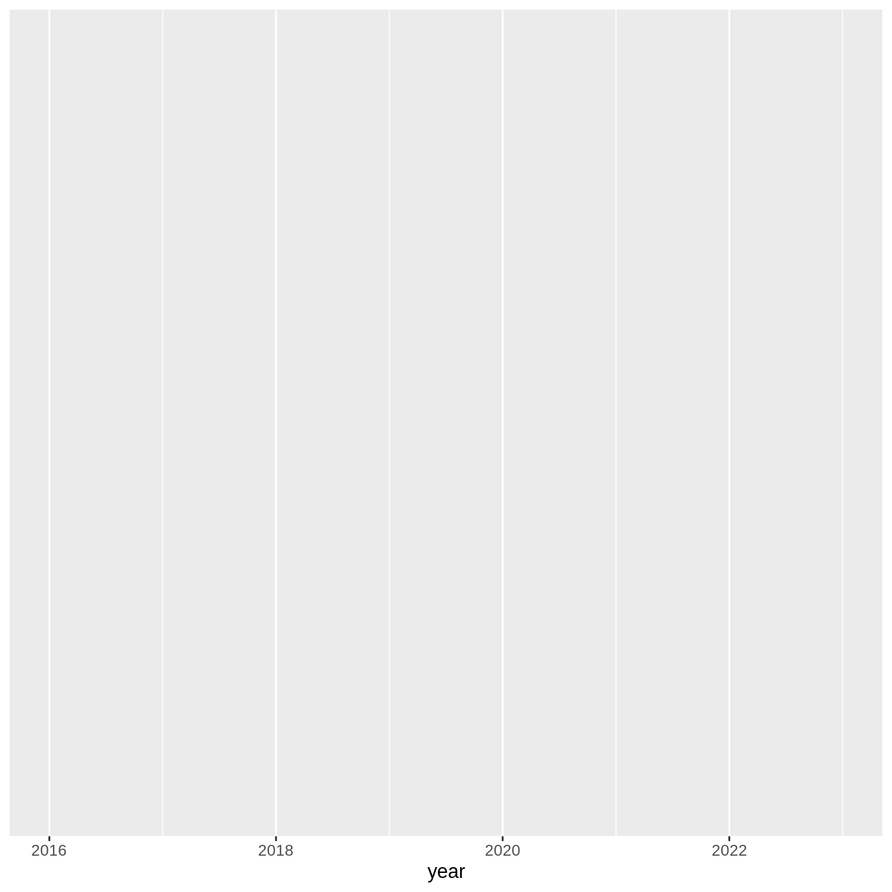
Next we need to  specify how we want the data to be displayed. We do this using `geom_` functions, which specify the type of geometry we want, such as points, lines, or bars. We use `geom_bar()` to create a vertical bar plot.

We can add a `geom_bar()` layer to our plot by using the `+` sign. We indent onto a new line to make it easier to read, and we have to **end** the first line with the `+` sign.


```r
ggplot(data = inat_year, mapping = aes(x = year)) +
  geom_bar()
```

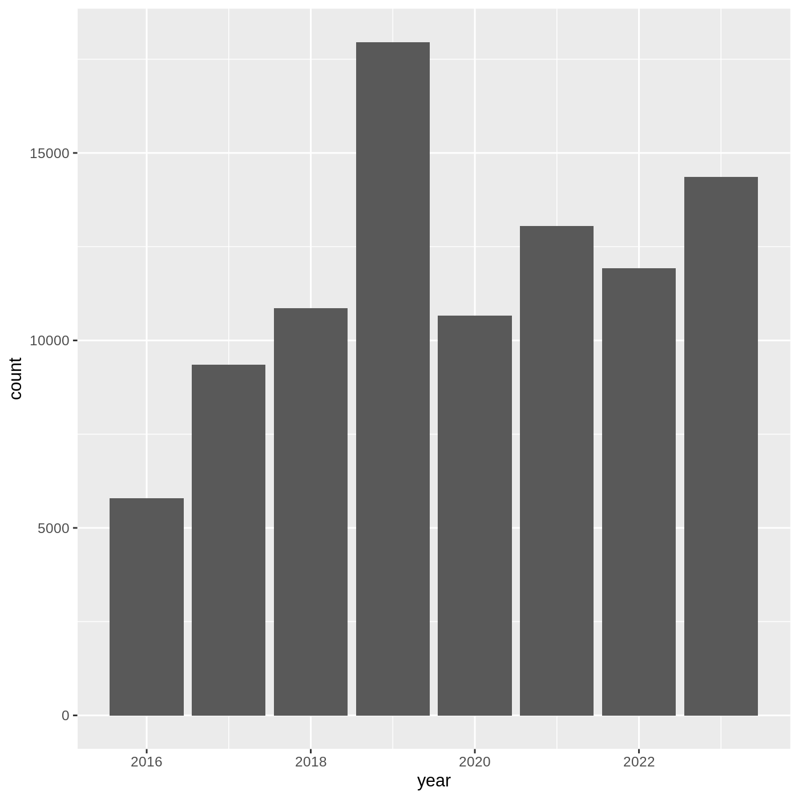
If we want year on x axis, and count on y axis, use `coord_flip()`


```r
ggplot(data = inat_year, mapping = aes(x = year)) +
  geom_bar() +
  coord_flip()
```

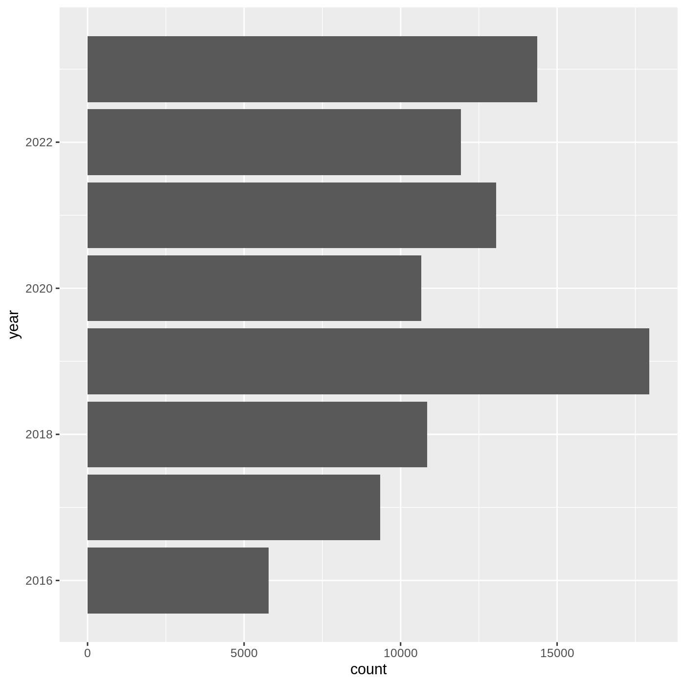


## Line chart

Create a line chart that shows the number of observations per year.

For line charts, we need both x and y variables. Create a dataframe that count the number of observations by year.


```r
inat_year_count <- inat %>% 
  mutate(year = year(observed_on)) %>%
  count(year, name='obs_count')  

inat_year_count
```

```output
# A tibble: 8 × 2
   year obs_count
  <dbl>     <int>
1  2016      5791
2  2017      9354
3  2018     10855
4  2019     17950
5  2020     10659
6  2021     13051
7  2022     11924
8  2023     14366
```
 We use  year on the x axis and  obs_count on the y axis. And we use `geom_line()` for to create a line chart.
 

```r
ggplot(data = inat_year_count, 
       mapping = aes(x = year, y=obs_count)) +
  geom_line()
```

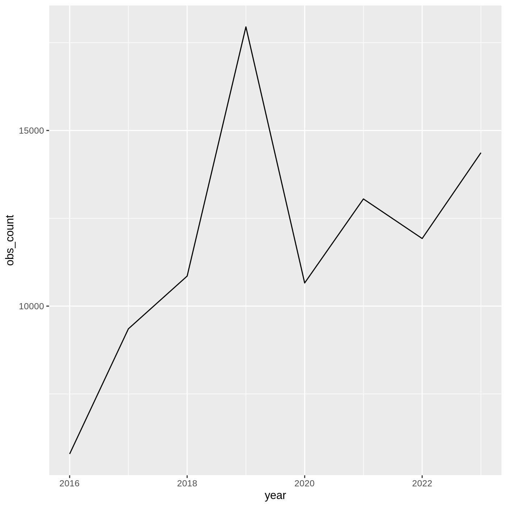

##  More bar plots

To create bar chart when we already have x and y, use `geom_col()`

We want year on the  x axis, and count on the y axis.


```r
ggplot(data = inat_year_count, 
       mapping = aes(x = year, y = obs_count)) +
  geom_col()
```

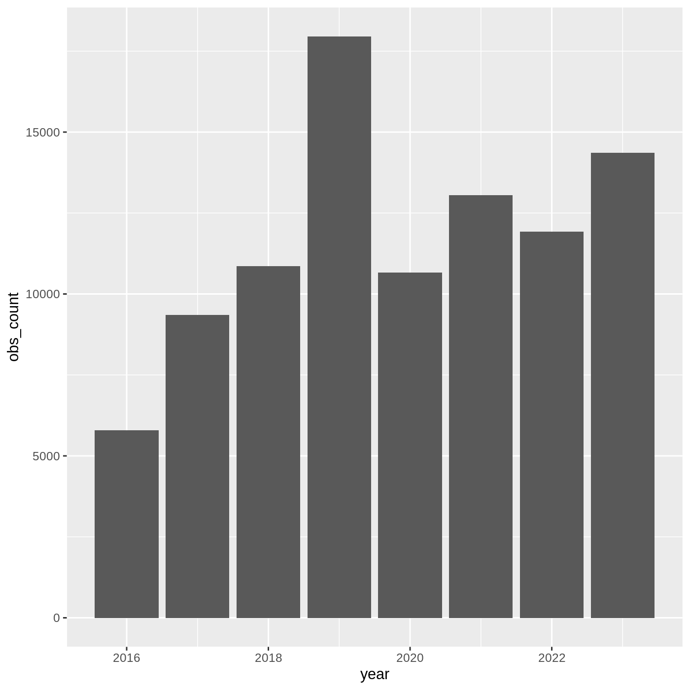


::::::::::::::::::::::::::::::::::::: challenge 

## Exercise 1


Create a chart with all your observations for each year
- Use `mutate()` and `filter()`
- 
::::::::::::::::::::::::::::::::::::::::::::::::


:::::::::::::::::::::::: solution 


```r
my_year  <- inat %>% 
  mutate(year = year(observed_on))  %>% 
  filter(user_login == 'natureinla')

  
ggplot(data = my_year, mapping = aes(x = year)) +
  geom_bar()
```

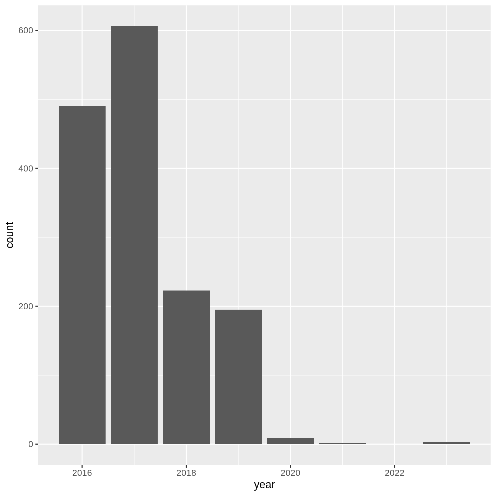
::::::::::::::::::::::::::::::::::::::::::::::::


## Changing aesthetics

Building **`ggplot`** plots is often an iterative process, so we'll continue developing the column plot we just made.  We can change the color of the bars using `fill='color'`.

Use `colors()`  to get a list of the 657 colors in R.

```r
colors()
```

```output
  [1] "white"           "aliceblue"       "antiquewhite"    "antiquewhite1"  
  [5] "antiquewhite2"   "antiquewhite3"   "antiquewhite4"   "aquamarine"     
  [9] "aquamarine1"     "aquamarine2"     "aquamarine3"     "aquamarine4"    
 [13] "azure"           "azure1"          "azure2"          "azure3"         
 [17] "azure4"          "beige"           "bisque"          "bisque1"        
 [21] "bisque2"         "bisque3"         "bisque4"         "black"          
 [25] "blanchedalmond"  "blue"            "blue1"           "blue2"          
 [29] "blue3"           "blue4"           "blueviolet"      "brown"          
 [33] "brown1"          "brown2"          "brown3"          "brown4"         
 [37] "burlywood"       "burlywood1"      "burlywood2"      "burlywood3"     
 [41] "burlywood4"      "cadetblue"       "cadetblue1"      "cadetblue2"     
 [45] "cadetblue3"      "cadetblue4"      "chartreuse"      "chartreuse1"    
 [49] "chartreuse2"     "chartreuse3"     "chartreuse4"     "chocolate"      
 [53] "chocolate1"      "chocolate2"      "chocolate3"      "chocolate4"     
 [57] "coral"           "coral1"          "coral2"          "coral3"         
 [61] "coral4"          "cornflowerblue"  "cornsilk"        "cornsilk1"      
 [65] "cornsilk2"       "cornsilk3"       "cornsilk4"       "cyan"           
 [69] "cyan1"           "cyan2"           "cyan3"           "cyan4"          
 [73] "darkblue"        "darkcyan"        "darkgoldenrod"   "darkgoldenrod1" 
 [77] "darkgoldenrod2"  "darkgoldenrod3"  "darkgoldenrod4"  "darkgray"       
 [81] "darkgreen"       "darkgrey"        "darkkhaki"       "darkmagenta"    
 [85] "darkolivegreen"  "darkolivegreen1" "darkolivegreen2" "darkolivegreen3"
 [89] "darkolivegreen4" "darkorange"      "darkorange1"     "darkorange2"    
 [93] "darkorange3"     "darkorange4"     "darkorchid"      "darkorchid1"    
 [97] "darkorchid2"     "darkorchid3"     "darkorchid4"     "darkred"        
 [ reached getOption("max.print") -- omitted 557 entries ]
```


```r
ggplot(data = inat_year, mapping = aes(x = year)) +
  geom_bar(fill='aquamarine')
```

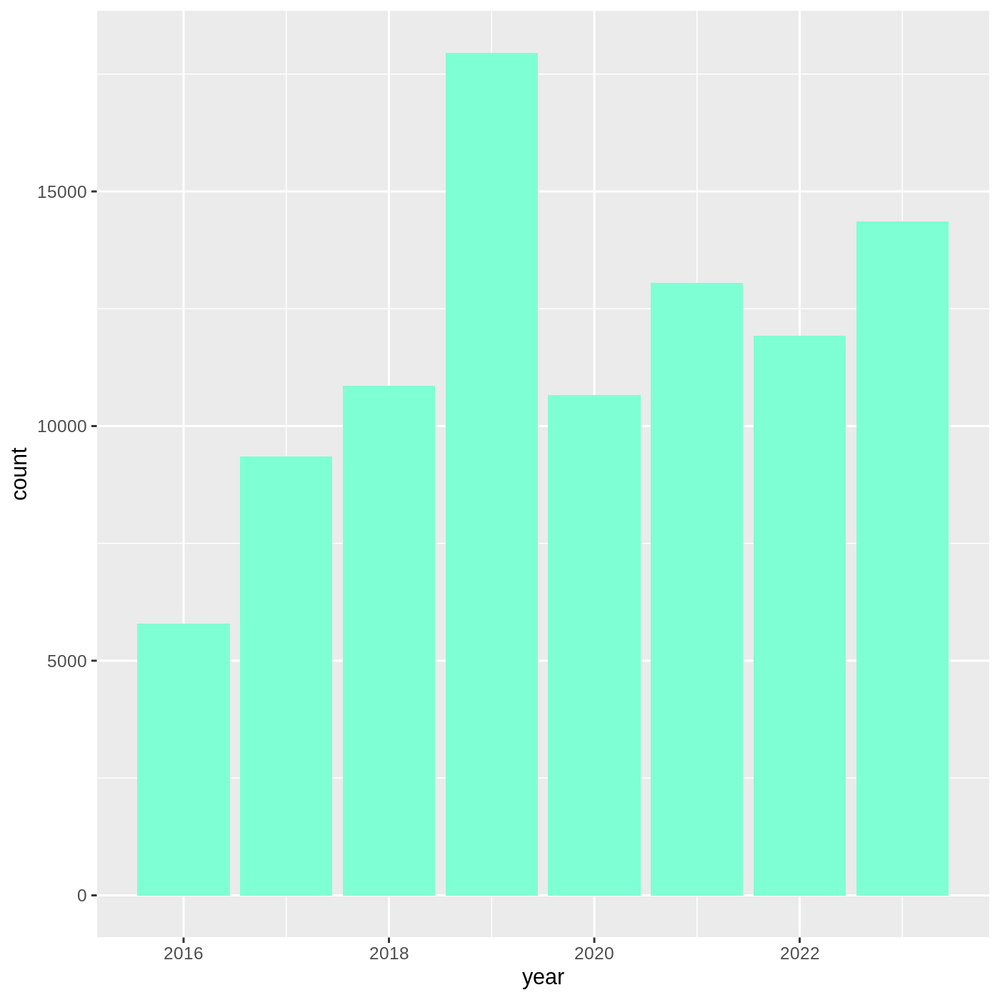
We can also use 6 digit hex color. You can use online tools to get hex colors. https://html-color.codes


```r
ggplot(data = inat_year, mapping = aes(x = year)) +
  geom_bar(fill='#75cd5e')
```

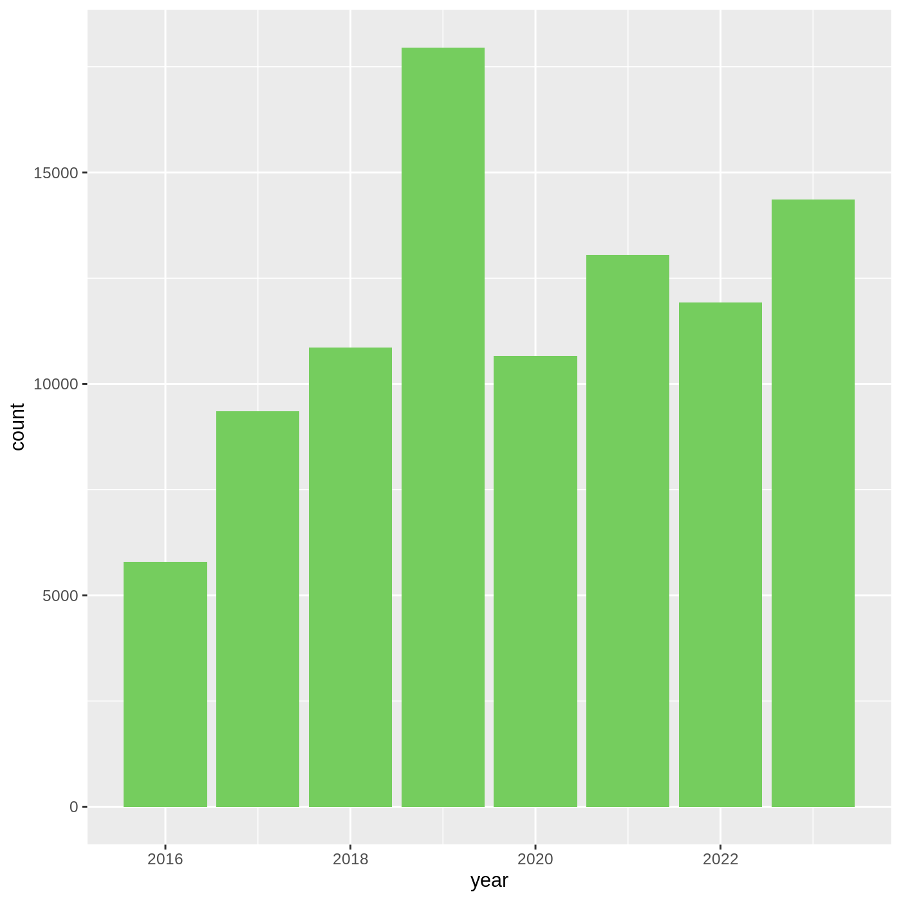

## Adding another variable

iNaturalist has  af field called `iconic_taxon_name` that assigns each taxa name to a some commonly known groups. 


```r
unique(inat$iconic_taxon_name)
```

```output
 [1] "Mollusca"       "Insecta"        "Reptilia"       "Aves"          
 [5] "Mammalia"       "Plantae"        "Animalia"       "Arachnida"     
 [9] "Amphibia"       "Fungi"          "Chromista"      "Actinopterygii"
[13] NA               "Protozoa"      
```

Create  charts that show the observations per year, and subdivide  each year by `iconic_taxon_name.` Give each `iconic_taxon_name` a different color.

 Since we're now mapping a variable (`iconic_taxon_name.`) to a component of the ggplot2 plot (`fill`), we need to put the argument inside `aes()`.
 
Create a bar chart that shows iconic_taxon_name by color.


```r
ggplot(data = inat_year, mapping = aes(x = year, fill=iconic_taxon_name)) +
  geom_bar()
```

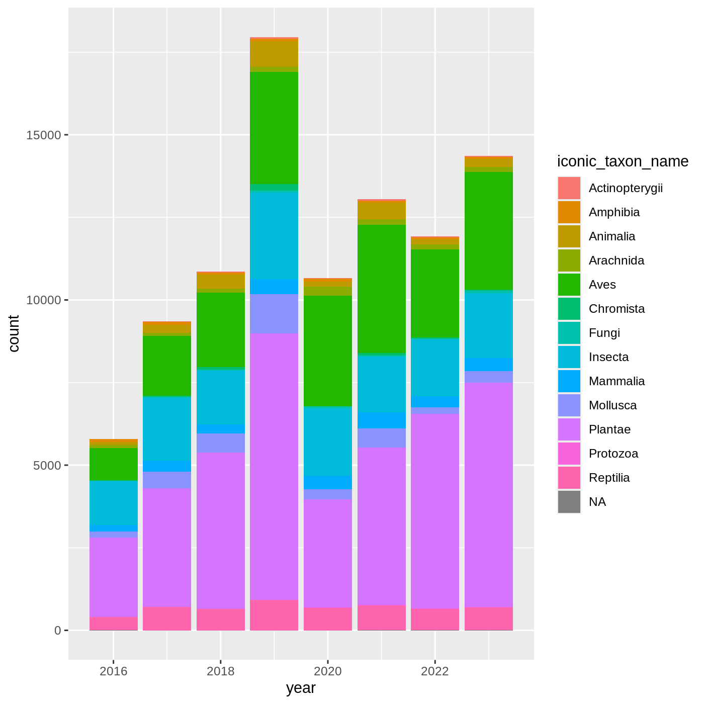
We create a new dataframe that counts the number observations per year and iconic_taxon_name. Use `mutate()` and `year()` to add a `year` column. We want count by both `year` and `iconic_taxon_name`. We want the column to be called `obs_count`.


```r
inat_year_iconic_count <- inat %>% 
  mutate(year = year(observed_on))  %>%
  count(year, iconic_taxon_name, name='obs_count') 

inat_year_iconic_count
```

```output
# A tibble: 107 × 3
    year iconic_taxon_name obs_count
   <dbl> <chr>                 <int>
 1  2016 Actinopterygii            1
 2  2016 Amphibia                 87
 3  2016 Animalia                 87
 4  2016 Arachnida                99
 5  2016 Aves                    976
 6  2016 Chromista                 9
 7  2016 Fungi                    24
 8  2016 Insecta                1325
 9  2016 Mammalia                192
10  2016 Mollusca                183
# ℹ 97 more rows
```
Create a line chart that shows iconic_taxon_name by color.


```r
inat_year_iconic_count %>% 
  ggplot(aes(x = year, y = obs_count, color = iconic_taxon_name)) +
  geom_line()
```

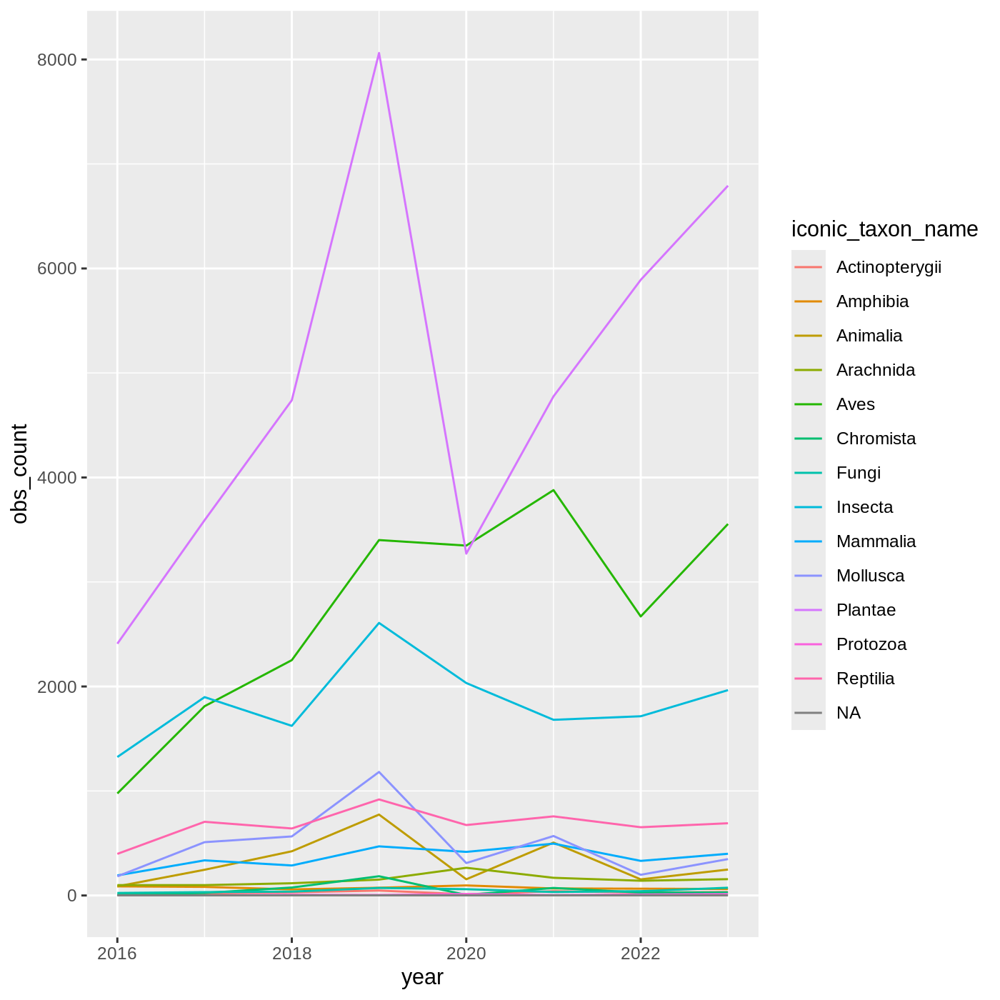


## Changing scales

The default color scheme isn't friendly to viewers with colorblindness.  **`ggplot2`** comes with quite a few other color scales, including  `viridis` scales, which are designed to be colorblind and grayscale friendly. See a list of color scales. https://ggplot2.tidyverse.org/reference/scale_colour_continuous.html


We can change scales by adding `scale_` functions to our plots:


```r
ggplot(data = inat_year, mapping = aes(x = year, fill=iconic_taxon_name)) +
  geom_bar() +
  scale_fill_viridis_d()
```

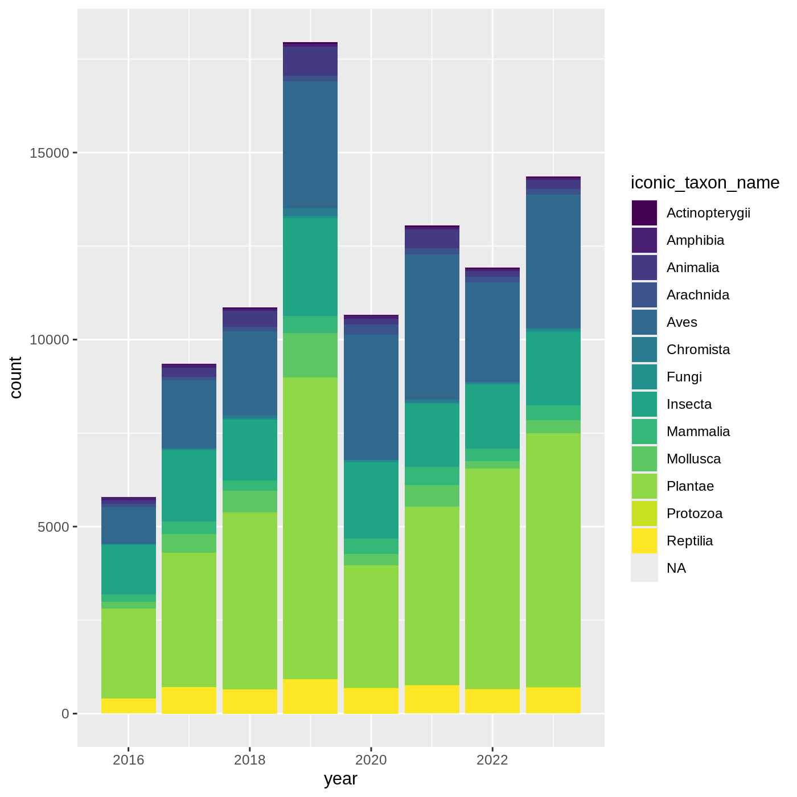

 
## Changing themes

we can assign a plot to an object 


```r
myplot <- ggplot(data = inat_year, mapping = aes(x = year)) +
  geom_bar(fill='#75cd5e')

myplot
```


We can change the overall appearance using `theme_` functions. Let's try a black-and-white theme by adding `theme_bw()` to our plot:


```r
myplot + 
  theme_bw()
```


To see a list of available themes in ggplot, visit https://ggplot2.tidyverse.org/reference/index.html#themes


To individually change parts of a plot, we can use the `theme()` function, which can take many different arguments to change things about the text, grid lines, background color, and more. 

Let's try changing the size of the text on our axis titles. We can do this by specifying that the `axis.title` should be an `element_text()` with `size` set to 14.


```r
myplot +
  theme_bw() +
  theme(axis.title = element_text(size = 14))
```


Another change we might want to make is to remove the vertical grid lines.  To do this, inside `theme()`, we will change the `panel.grid.major.x` to an `element_blank()`.


```r
myplot +
  theme_bw() +
  theme(axis.title = element_text(size = 14), 
        panel.grid.major.x = element_blank(),
        panel.grid.minor.x = element_blank())
```


 
Because there are so many possible arguments to the `theme()` function, it can sometimes be hard to find the right one. Here are some tips for figuring out how to modify a plot element:

- type out `theme()`, put your cursor between the parentheses, and hit <kbd>Tab</kbd> to bring up a list of arguments
    - you can scroll through the arguments, or start typing, which will shorten the list of potential matches
- like many things in the `tidyverse`, similar argument start with similar names
    - there are `axis`, `legend`, `panel`, `plot`, and `strip` arguments
- arguments have hierarchy
    - `text` controls all text in the whole plot
    - `axis.title` controls the text for the axis titles
    - `axis.title.x` controls the text for the x axis title

 

## Changing labels

 We  customize the axis labels and add a chart title `labs()` function.


```r
myplot +
  theme_bw() +
  theme(axis.title = element_text(size = 14), 
        plot.title = element_text(face = "bold", size = 20)) +
  labs(title = "CNC Los Angeles",
       subtitle="Observations per year",
       x = "Year",
       y = "Observations")
```

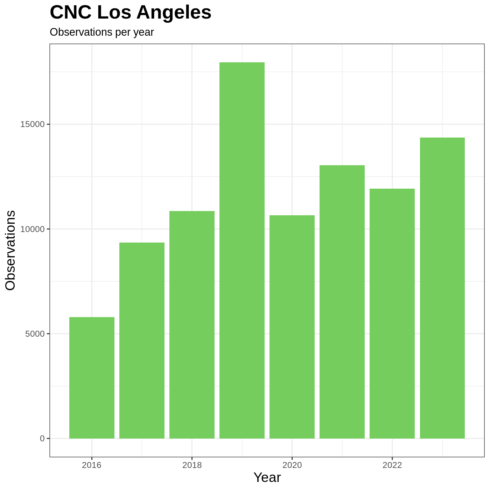

::::::::::::::::::::::::::::::::::::: challenge 

## Exercise 2: Customizing a plot

Take the chart from exercise  1 (your observations for each year) and assign  it to an object.

Customize the appearance. Here are some ideas.
- add a title
- choose the one of the built in themes
- change the axis titles
- change the colors of the bar or line 

::::::::::::::::::::::::::::::::::::::::::::::::

:::::::::::::::::::::::: solution 


```r
my_yearly_plot  <- inat %>% 
  mutate(year = year(observed_on))  %>% 
  filter(user_login == 'natureinla') %>% 
  ggplot(data = my_year, mapping = aes(x = year)) +
  geom_bar(fill='#E0A90A')

my_yearly_plot +
  theme_classic() +
  labs(title = "CNC Los Angeles",  x = "Year",  y = "Observations") 
```

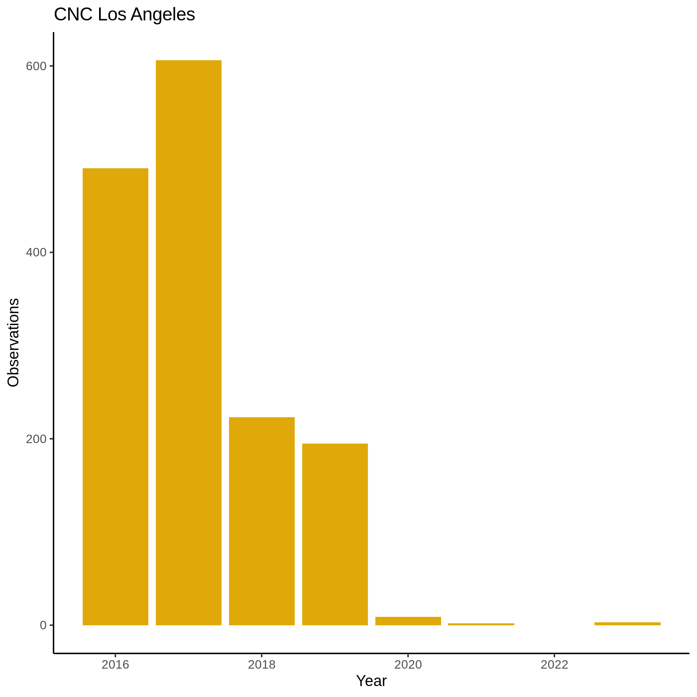
::::::::::::::::::::::::::::::::::::::::::::::::


## Exporting plots

Once we are happy with ourplot, we can export the plot.

Assign the plot to an object.  Then run `ggsave()` to save our plot.  The first argument we give is the path to the file we want to save, including the correct file extension. You can save as jpb, pdf, tiff, png.  Next, we tell it the name of the plot object we want to save. We can also specify things like the width and height of the plot in inches.


```r
finalplot <- myplot +
  theme_bw() +
  theme(axis.title = element_text(size = 14), 
        plot.title = element_text(face = "bold", size = 20)) +
  labs(title = "CNC Los Angeles",
       subtitle="Observations per year",
       x = "Year",
       y = "Observations")
```


```r
ggsave(filename = 'data/cleaned/observations_per_year.jpg', plot = finalplot,  height = 6, width = 8)
```
