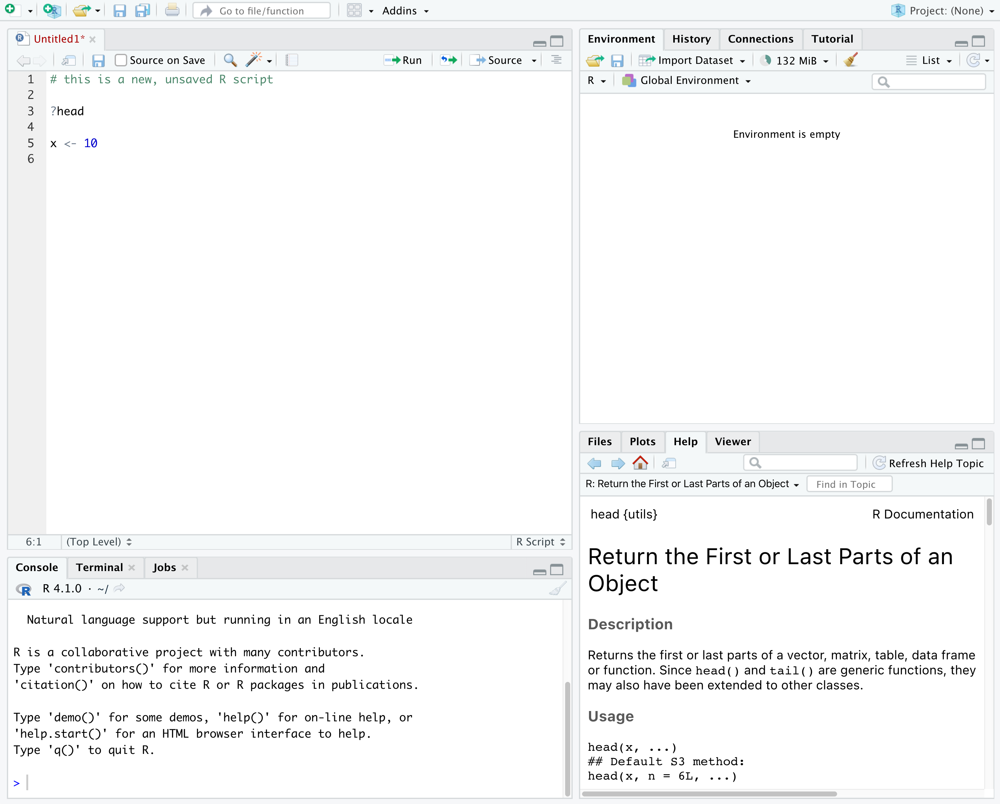

```{r setup, include=FALSE}
knitr::opts_chunk$set(dpi = 200, out.height = 600, out.width = 600, R.options = list(max.print = 100))
```


:::::::::::::::::::::::::::::::::::::: questions 

- Why should you use R and RStudio?
- How do you get started working in R and RStudio?

::::::::::::::::::::::::::::::::::::::::::::::::

::::::::::::::::::::::::::::::::::::: objectives

- Understand the difference between R and RStudio
- Describe the purpose of the different RStudio panes
- Organize files and directories into R Projects

::::::::::::::::::::::::::::::::::::::::::::::::

## What are R and RStudio?

R refers to a programming language as well as the software that runs R code.

[RStudio](https://rstudio.com) is a software application that can make it easier to write and run code in R. 

Think of R as English, and RStudio as Microsoft Word or Google Docs.

Both R and RStudio are: 
- free
- cross platform: works on Mac, Windows, Linux 
- open source: allows anyone to use and modify the software


## Navigating RStudio

RStudio puts most of the things you need to work in R into a single window, and also includes features like keyboard shortcuts, autocompletion of code, and syntax highlighting (different types of code are colored differently, making it easier to navigate your code).

{alt='Screenshot of RStudio showing the 4 "panes".'}

In the above screenshot, we can see 4 "panes" in the default layout:

- Top-Left: the **Source** pane that displays scripts and other files. You will write code into scripts and run code.
  - If you only have 3 panes, and the Console pane is in the top left, press <kbd>Shift+Cmd+N</kbd> (Mac) or <kbd>Shift+Ctrl+N</kbd> (Windows) to open a blank R script, which should make the Source pane appear.
- Top-Right: the **Environment/History** pane, which shows all the objects in your current R session (Environment) and your command history (History)
- Bottom-Left: the **Console** pane, where you can interact directly with an R console, which interprets R commands and prints the results
- Bottom-Right: the **Files/Plots/Help/Viewer** pane to navigate files on our computer, view plots and view help pages


# Getting set up in RStudio

RStudio provides a “Projects” feature that can make it easier to work on individual projects in R. We will create a project that we will keep everything for this workshop.

1. Start RStudio (you should see a view similar to the screenshot above).
2. In the top right, you will see a blue 3D cube and the words “Project: (None)”. Click on this icon.
3. Click New Project from the dropdown menu.
4. Click New Directory, then New Project.
5. Type out a name for the project.
6. Put it in a convenient location using the “Create project as a subdirectory of:” section.  You can always move the project somewhere else later, because it will be self-contained.
7. Click Create Project and your new project will open.

When you need to work on the project, click on the  Rproj icon to start RStudio.

One of the benefits to using RStudio Projects is that they automatically set the working directory to the top-level folder for the project. The working directory is the folder where R is working, so it views the location of all files (including data and scripts) as being relative to the working directory.  


## Organizing your project directory

Using a consistent folder structure across all your new projects will help keep a growing project organized, and make it easy to find files in the future. 

We will use a basic structure for this workshop. 

```
project_folder
│
└── scripts
│
└── data
│    └── cleaned
│    └── raw
│
└─── images
│
└─── documents
```

Within our project folder, we first have a `scripts` folder to hold any scripts we write. We also have a `data` folder containing `cleaned` and `raw` subfolders. In general, you want to keep your `raw` data completely untouched, so once you put data into that folder, you do not modify it. Instead, you read it into R, and if you make any modifications, you write that modified file into the `cleaned` folder. We also have an `images` folder for plots we make, and a `documents` folder for any other documents you might produce.

